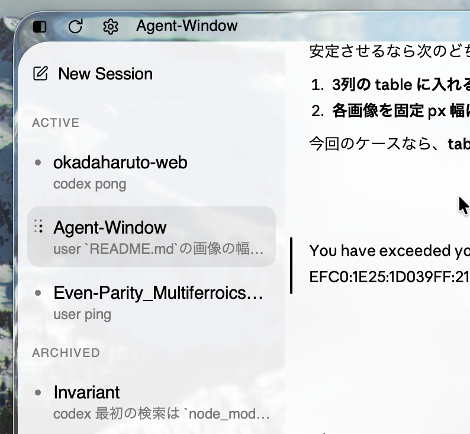
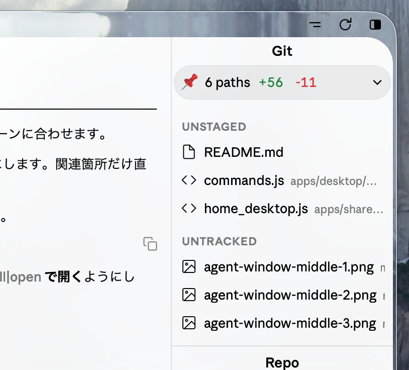
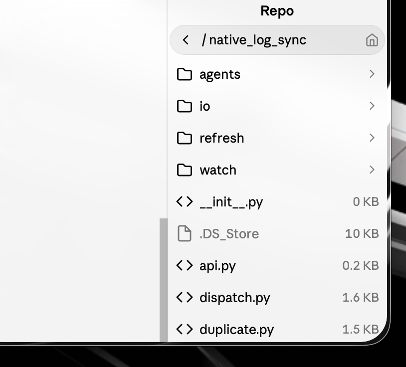
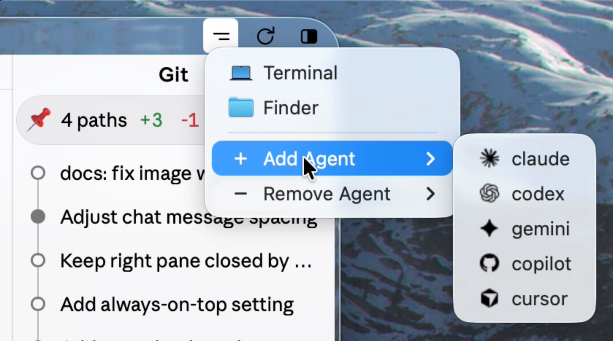

# Agent Window

Agent Window is an application for controlling the CLI tools of Claude, Codex, Gemini, Cursor, Copilot, and other agents.
It works with regular subscriptions only.

<p align="center">
  
  
</p>

# Backend

In this repository, each session is associated with one tmux process and one chat server.
You can add or remove any agents in the panes within each process. In other words, a single session can be operated with multiple agents.
Even if you restart a CLI or repeatedly remove and re-add an agent, logs are appended to the same local JSONL file as long as it remains the same session.

## Sending

The sending backend uses `tmux send-key`.
Messages can also be sent from one agent to another, whether they are in the same session or in different sessions.

## Receiving

For receiving, Agent Window resolves each CLI's native log path from sources such as the PID tree, then monitors it directly with kqueue.
The path is re-resolved at specific timings, such as when the chat server is reloaded or when a CLI is restarted.
Events are mainly classified into messages and tool calls. Only messages are recorded in the session JSONL file, while tool calls are streamed temporarily.

## App

The Mac version is provided as a Tauri app built with Rust.
It is only a thin wrapper for improving the appearance; the actual application is just a web app.
A PWA is also provided for smartphones.

# Frontend

## Hub (left sidebar)

The Hub server manages the session list.
You can start new sessions, archive sessions, and delete sessions from here.
You can also change appearance settings and global feature settings from here.

<p align="center">
  
  
</p>

### Appearance

Three themes are available: dark, light, and mixed.

### Auto Approval

When Auto Approval is turned on, tool calls from all agents are automatically approved regardless of the CLI-side settings.
Only agents in the Running state are polled with `tmux capture-pane`; when an approval prompt string is found, Agent Window simply sends Enter. This is a deliberately simple and rough implementation.

### Always on Top

When Always on Top is turned on, the window always stays in front.

## Chat view (center and right)

This is the main view. It is basically the same as a typical agent window.

### Input box

<p align="center">
  
</p>

The input box is usually minimized to maximize the display area for the chat body.
It can be expanded with the `O` button at the bottom.
Messages entered here are pasted directly into the selected agent's CLI pane.
In other words, you can use the commands of each CLI as-is.
Typing `@` lets you search files inside the repository; the results from FSEvents, described later, are cached.
Files can be attached with the plus button or by drag and drop.
Attached files are saved under `.agent-window/uploads/`.

### Workspace management

<p align="center">
  
  
</p>

The right pane synchronizes the workspace state using the standard FSEvents approach.
It includes a feature for displaying only uncommitted changes in a compact form.
Only deletion and ignoring of untracked files, as well as file-level revert buttons, are implemented.

The embedded file viewer is minimal, but it supports HTML display and Markdown rendering.
When `External Editor` is turned on in the settings, files are opened in the specified external editor. This is the default behavior.

### Menu button

The hamburger button in the upper-right corner provides the following actions.

<p align="center">
  
</p>

**Terminal**: Opens the tmux terminal itself. It is kept compact.
**Finder**: Opens the session workspace in Finder.
**Add / Remove Agent**: Adds or removes agents from the session. Multiple instances of the same agent can also be added. They are handled by instance names such as `Claude-3`.
**reload**: Performs a hard reload of the chat server. If you have edited the source code, the updated code will be loaded. If something goes wrong, try reload first.

# Setup

## Tauri App + HTTP

Basically, Agent Window assumes use through the Tauri app.

Before starting, install `python3`, `tmux`, `cargo`, `tauri-cli`, and Xcode Command Line Tools.

Install and authenticate the Agent CLIs you want to use, such as Claude, Codex, Gemini, Cursor, and Copilot, in advance.

```bash
./tauri_app/tauri_start
```

This command builds the Tauri app, and the Hub is launched from the Tauri app.

The default port for the Hub is `8788`.

After startup, start a session from `New Session` in the Hub.

To rebuild only:

```bash
./tauri_app/tauri-build
```

## PWA / HTTPS

The HTTP Tauri app must already be running first.

```bash
./setup/pwa/enable
./tauri_app/tauri_start
```

`./setup/pwa/enable` checks the running Hub, then prepares mkcert and the local certificate.

After the PWA is enabled, Agent Window checks `~/.agent-window/state/pwa/enabled` and automatically starts with HTTPS.

Send mkcert's `rootCA.pem` to your device, install the certificate profile, and enable trust for it.

Then open the following URL in Safari:

```text
https://<Mac LAN IP>:8788/ or
https://<Mac name>.local:8788/
```

Add it to the home screen to use it as a PWA.

<p align="center">
  
  
  
  
</p>
