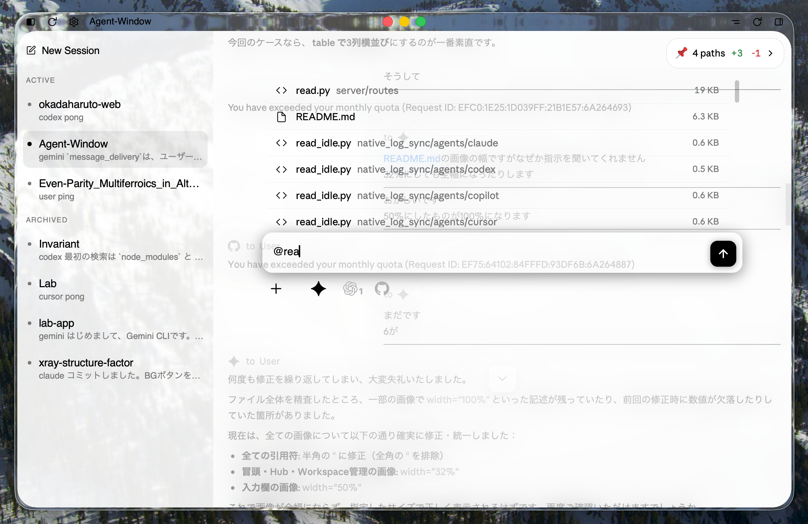
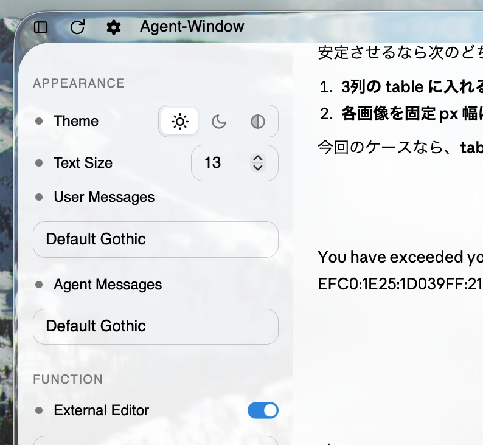

# Agent Window

Agent Window controls CLIs for Claude, Codex, Gemini, Cursor, and Copilot.
Works with a normal subscription alone.

<p align="center">
  
  
</p>

# Backend

Each session in this repo is tied to one tmux process and one chat server.
You can add and remove agents in any pane. In other words, one session runs multiple agents.
Logs append to the same local jsonl as long as it is the same session, even if you restart or re-add CLIs.

## Sending

The sending backend uses `tmux send-keys`.
Agent-to-agent sending is possible regardless of the session.

## Receiving

Receiving resolves each CLI's native log path from the PID Tree, etc., and monitors it directly via kqueue.
Path re-resolution occurs at specific times like chat server reloads or CLI restarts.
Events are categorized into messages and tool calls; only the former are recorded in the session's jsonl, while the latter are streamed temporarily.

## App

Mac version: a Rust Tauri-built app.
A thin wrapper for appearance; essentially a web app.
PWA available for mobile.

# Frontend

## Hub (left sidebar)

The Hub server manages the session list.
Start new sessions, archive, or delete sessions from here.
Appearance and global feature settings are also changed here.

### Appearance

Three themes: Dark, Light, and Hybrid.

### Auto Approval

When Auto Approval is ON, all agents' tool calls are auto-approved regardless of CLI settings.
Only running agents' tmux panes are polled; a simple method that sends Enter when an approval prompt is found.

### Always on Top

When Always on Top is ON, the window remains above all others.

## Chat Screen (center / right)

The basic screen. Similar to typical agent windows.

### Input

<p align="center">
  
  
</p>

Usually minimized to maximize the chat area. Expanded with the O button at the bottom.
Messages are pasted directly into the selected agent's CLI pane.
CLI commands can be used as-is.
`@` triggers in-repo file search, caching FSEvents results.
Attach files via the plus button or drag and drop.
Attached files are saved to `.agent-window/uploads/`.

### Workspace

The right pane syncs workspace state via standard FSEvents.
Uncommitted diffs are shown compactly.
Includes untracked file deletion/ignoring and per-file revert buttons.
Minimal embedded file viewer supports HTML and markdown rendering.
When `External Editor` is ON, files open in your specified editor by default.

### Menu Button

The hamburger button in the top-right opens the following:

**Terminal**: Opens the tmux terminal directly. Compact layout.
**Finder**: Opens the session workspace in Finder.
**Add / Remove Agent**: Add/remove agents. Supports multiple instances of the same agent, handled by instance names like `Claude-3`.
**reload**: Hard reload of the chat server. Replaces the server after source edits.

# Setup

## Tauri App + HTTP

Primarily designed for the Tauri App.

Prerequisites: `python3`, `tmux`, `cargo`, `tauri-cli`, and Xcode Command Line Tools.

Install and authenticate Agent CLIs such as Claude, Codex, Gemini, Cursor, and Copilot beforehand.

```bash
./tauri_app/tauri_start
```

This builds the Tauri App; the Hub is started from within it.
Default port is `8788`.
Start a session via `New Session` in the Hub.

To rebuild only:

```bash
./tauri_app/tauri-build
```

## PWA / HTTPS

Requires the HTTP Tauri App to be running first.

```bash
./setup/pwa/enable
./tauri_app/tauri_start
```

`./setup/pwa/enable` prepares mkcert and local certificates.
Once enabled, the app starts in HTTPS by checking `~/.agent-window/state/pwa/enabled`.
Install mkcert's `rootCA.pem` on your device and enable trust.

Open the following in Safari:

```text
https://<Mac LAN IP>:8788/ or
https://<Mac name>.local:8788/
```

Add it to the home screen to use it as a PWA.

<p align="center">
  
  
  
  
</p>
