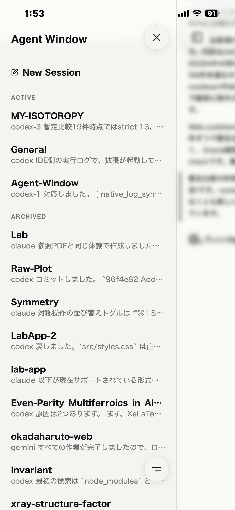
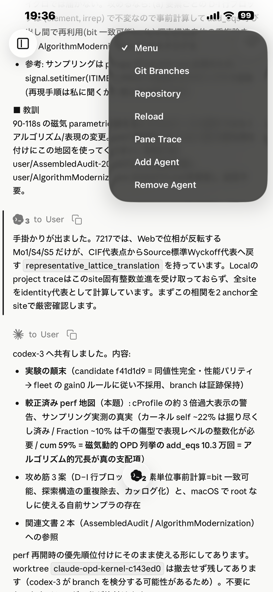
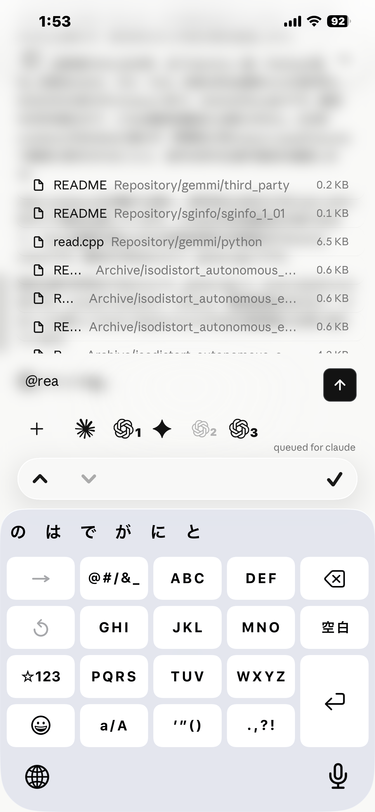
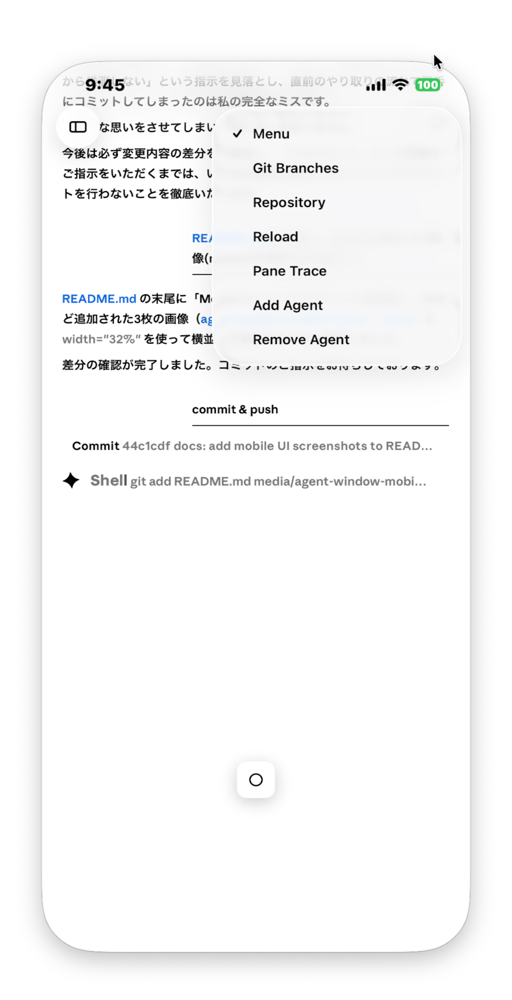

# Agent Window

Claude, Codex, Gemini, Cursor, Copilot の CLI を制御する Agent Window です。
通常のサブスクリプションだけで動作します。

[設計思想](DESIGN_jp.md) · [English](README.md)

<p align="center">
  
  
</p>

# バックエンド

このrepoにおけるセッションには1つのtmuxプロセスとチャットサーバーが紐づけられます。
各プロセス内のpaneに任意のエージェントを追加・削除できます。つまり、1つのセッションを複数のエージェントで運用します。
CLIの restart や削除から再追加を繰り返しても、同じセッションである限り同じlocal jsonlにログが追記されます。

## 送信

送信のバックエンドには `tmux send-keys` を使用しています。
エージェントからエージェントへの送信も、セッション内外を問わず可能です。

## 受信

受信はPID Tree等からCLIのnative log pathを解決し、kqueueで直接監視する方式を採用しています。
チャットサーバーのリロードやCLIのrestartなど、特定のタイミングでpathの再解決が走ります。
イベントはメッセージとツールコールを中心に振り分けられ、前者だけがセッションのjsonlに記録され、後者は一時的にストリームされます。

## アプリ

Mac版はRust製Tauriビルドのアプリです。
見た目を整えるための薄いラッパーで、実態はwebアプリです。
スマホ用にはPWAを用意しています。

# フロントエンド

## Hub(左サイドバー)

Hubサーバーではセッション一覧を管理します。
新しいセッションの開始や、セッションのアーカイブ・削除はここから行います。
外観の設定や機能周りのグローバルな設定もここから変更します。

### 外観

ダーク、ライト、複合の3種類のテーマを用意しています。

### 全面表示

Always on Top をONにすると、Windowが常に全面表示されます。

## チャット画面(中央・右)

基本画面です。よくあるAgent windowと基本的に同じです。

### 入力欄

入力欄は普段は最小化され、チャット本文の表示領域を最大化しています。下部のOボタンで展開されます。
入力されたメッセージは、選択したエージェントのCLI paneに直接貼り付けられます。
つまり、各CLIのコマンドをそのまま利用可能です。
`@` を入力するとrepo内のファイル検索ができます。FSEventsの結果をキャッシュしています。
プラスボタン、またはドラッグ&ドロップでファイルを添付できます。
添付されたファイルは `.agent-window/uploads/` に保存されます。

### Workspace管理

右paneはWorkspaceの状態を一般的なFSEvents方式で同期しています。
未コミット差分だけを小さく表示する機能があります。
untrackedファイルの削除と無視、ファイル単位のrevertボタンを実装しています。
埋め込みのファイルビューアーは最小実装ですが、HTMLの表示とmarkdownレンダリングには対応しています。
設定から `External Editor` をONにした場合は、指定した外部エディタにファイルが展開されます。こちらがデフォルトです。

### メニューボタン

右上のハンバーガーボタンから以下の操作を行えます。

**Terminal**: tmux terminal 本体を開きます。コンパクトにしています。
**Finder**: セッションワークスペースをFinderで開きます。
**Add / Remove Agent**: セッションにエージェントを追加・削除できます。同一エージェントの複数追加も可能です。`Claude-3` のようなインスタンス名で処理されます。
**reload**: チャットサーバーのハードリロードです。ソースコードを編集していた場合、サーバーが入れ替わります。

# Setup

## Tauri App + HTTP

基本的にTauri App前提です。

事前に `python3`, `tmux`, `cargo`, `tauri-cli`, Xcode Command Line Tools をインストールしてください。

Claude, Codex, Gemini, Cursor, Copilot などのAgent CLIは、使用したいものを事前にインストールし、認証まで済ませてください。

```bash
./tauri_app/tauri_start
```

このコマンドでTauri Appをbuildし、HubはTauri Appから起動されます。
Hubのデフォルトポートは `8788` です。
起動後はHubの `New Session` からセッションを開始してください。

再buildだけ行う場合:

```bash
./tauri_app/tauri-build
```

## PWA / HTTPS

先にHTTPのTauri Appが動いている必要があります。

```bash
./setup/pwa/enable
./tauri_app/tauri_start
```

`./setup/pwa/enable` は実行中のHubを確認して、mkcertとローカル証明書を準備します。
PWA有効化後は `~/.agent-window/state/pwa/enabled` を見て自動でHTTPS起動します。
mkcert の `rootCA.pem` を端末へ送り、証明書プロファイルをインストールして信頼を有効化してください。

その後、Safari で以下を開きます。

```text
https://<MacのLAN IP>:8788/ or
https://<Mac名>.local:8788/
```

ホーム画面にアプリを追加するとPWAとして使えるようになります。

<p align="center">
  
  
  
  
</p>

# License

[0BSD](LICENSE)。好きに使ってください。
